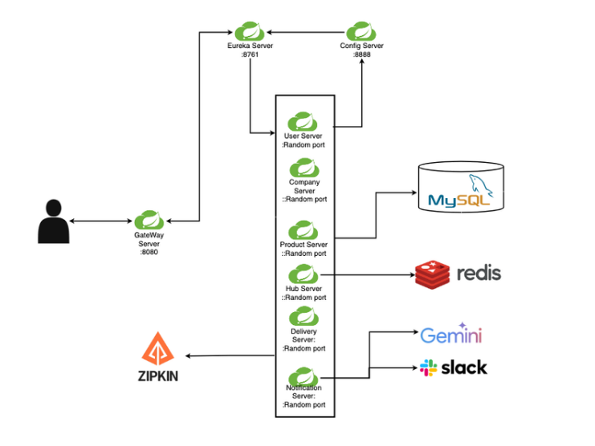
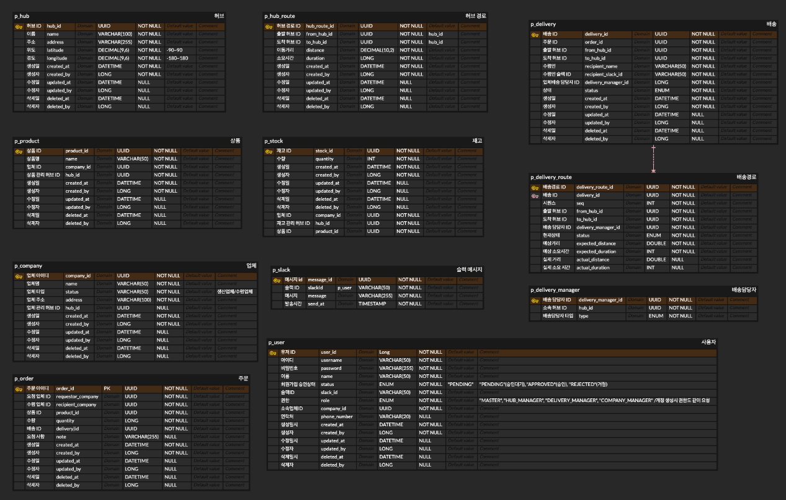
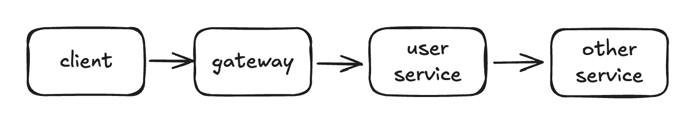
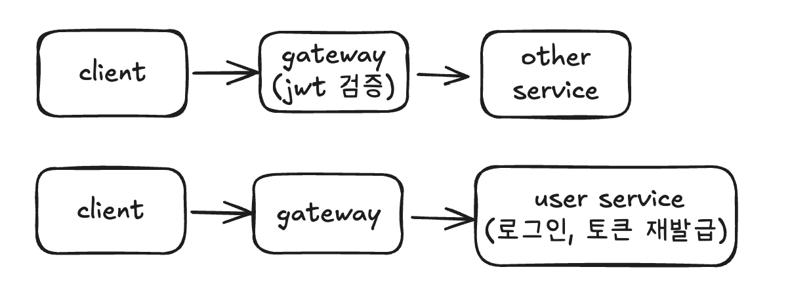
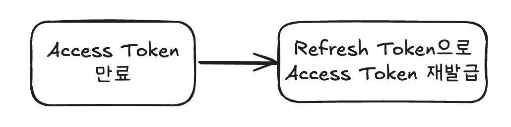
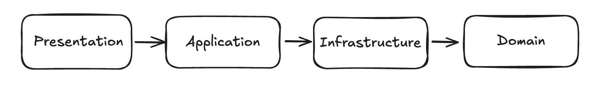

# 🚚 프로젝트명

> MSA 기반 물류 관리 시스템

**개발 기간:** 2025.10.31 ~ 2025.11.13

---

## 📋 프로젝트 소개

이 프로젝트는 물류 관리·배송 시스템을 MSA 기반으로 구성한 프로젝트입니다.  
허브, 경로, 주문, 배송 등 기능을 도메인 단위로 나누고, 각 서비스가 데이터를 주고받으며 동작하는 구조를 설계했습니다.  
전체적으로 MSA 구조를 직접 구성해 보고, 서비스 간 연동과 도메인 설계를 경험하는 데 집중한 프로젝트입니다.

---

## 🛠 기술 스택

**Backend**
<p>
 
 


</p>

**Database**
<p> 


</p>

**External API**
<p>
 

</p>

---

## 🏗 아키텍처

### 프로젝트 구조

<details>
<summary><strong>전체 구조 보기</strong></summary>

```text
HubEleven
┣ common
┃ ┣ build.gradle
┃ ┗ src/main/java/com/hubEleven/common
┃     ┣ annotation
┃     ┣ code
┃     ┣ exception
┃     ┣ model
┃     ┣ request
┃     ┗ response
┣ config
┃ ┣ build.gradle
┃ ┗ src
┃     ┣ main/java/com/hubEleven/config
┃     ┗ main/resources/config-repo
┣ eurekaServer
┃ ┣ build.gradle
┃ ┗ src/main/java/com/hubEleven/eurekaServer
┣ gateWay
┃ ┣ build.gradle
┃ ┗ src/main/java/com/hubEleven/gateWay
┃     ┣ config
┃     ┗ security
┣ hub
┃ ┣ build.gradle
┃ ┗ src/main/java/com/hubEleven/hub
┃     ┣ application
┃     ┣ common
┃     ┣ domain
┃     ┣ infrastructure
┃     ┗ presentation
┣ company
┃ ┣ build.gradle
┃ ┗ src/main/java/com/hubEleven/company
┃     ┣ application
┃     ┣ domain
┃     ┣ infrastructure
┃     ┗ presentation
┣ delivery
┃ ┣ build.gradle
┃ ┗ src/main/java/com/hubEleven/delivery
┃     ┣ config
┃     ┣ delivery
┃     ┃   ┣ application
┃     ┃   ┣ domain
┃     ┃   ┣ infrastructure
┃     ┃   ┗ presentation
┃     ┣ deliveryManager
┃     ┃   ┣ application
┃     ┃   ┣ domain
┃     ┃   ┣ infrastructure
┃     ┃   ┗ presentation
┃     ┗ deliveryRoute
┃         ┣ application
┃         ┗ domain
┣ notification
┃ ┣ build.gradle
┃ ┗ src/main/java/com/hubEleven/notification
┃     ┣ ai
┃     ┃   ┣ application
┃     ┃   ┣ domain
┃     ┃   ┣ infrastructure
┃     ┃   ┗ presentation
┃     ┗ slack
┃         ┣ application
┃         ┣ domain
┃         ┣ infrastructure
┃         ┗ presentation
┣ order
┃ ┣ build.gradle
┃ ┗ src/main/java/com/hubEleven/order
┃     ┣ application
┃     ┣ domain
┃     ┣ infrastructure
┃     ┗ presentation
┣ product
┃ ┣ build.gradle
┃ ┗ src/main/java/com/hubEleven/product
┃     ┣ product
┃     ┃   ┣ application
┃     ┃   ┣ domain
┃     ┃   ┣ infrastructure
┃     ┃   ┗ presentation
┃     ┗ stock
┃         ┣ application
┃         ┣ domain
┃         ┣ infrastructure
┃         ┗ presentation
┣ user
┃ ┣ build.gradle
┃ ┗ src/main/java/com/hubEleven/user
┃     ┣ application
┃     ┣ domain
┃     ┣ infrastructure
┃     ┗ presentation
┣ build.gradle
┣ settings.gradle
└ README.md
```
</details>

### Architecture


---

## 🗄 ERD


---

## ✨ 주요 기능

<details>
<summary><strong>1. 인증·사용자 관리</strong></summary>

- 회원가입 / 로그인 / 로그아웃 / 토큰 재발급
- 사용자 단건 조회 / 목록 조회·검색
- 사용자 역할 변경 (MASTER 권한)
- 사용자 정보 수정 & 자기 계정 삭제
- 가입 승인/거절(Approval) 프로세스
- 허브 관리자·마스터 권한에 따른 접근 제어

</details>

<details>
<summary><strong>2. 허브 관리</strong></summary>

- 허브 생성 / 수정 / 삭제
- 허브 단건 조회 / 목록 조회 / 키워드 검색
- 허브 위치 변경에 따른 경로 재계산 트리거 (도메인 이벤트)

</details>

<details>
<summary><strong>3. 허브 경로(Hub Route) 관리</strong></summary>

- 경로 생성 / 수정 / 삭제
- 출발·도착 허브 기준 검색
- 경로 상세 조회
- 허브 변경에 따른 전체 경로 재생성 로직 처리

</details>

<details>
<summary><strong>4. 주문(Order) 관리</strong></summary>

- 주문 생성 / 조회 / 단건 상세 조회
- 주문 수정(수량·요청사항)
- 주문 취소 / 삭제
- 요청사·수령사·상품·상태 기반 필터 검색
- 담당 허브/배송 담당자/회사 관리자 등 권한에 따른 조회 범위 제어

</details>

<details>
<summary><strong>5. 배송(Delivery) 관리</strong></summary>

- 배송 생성(내부 자동 생성 포함)
- 배송 전체 조회 / 상세 조회
- 배송 상태 업데이트
- 배송 삭제
- 배송 경로(legs) 조회 및 상태 변경
- 특정 담당자에게 자동 배정 기능

</details>

<details>
<summary><strong>6. 배송 담당자(Delivery Manager) 관리</strong></summary>

- 담당자 등록 / 수정 / 삭제
- 본인 정보 조회
- 담당자 전체 조회 / 상세 조회
- 담당자 순번 조회(로스터 기능)
- 자동 배정 API 지원

</details>

<details>
<summary><strong>7. 업체(Company) 관리</strong></summary>

- 업체 등록 / 수정 / 삭제
- 업체 전체 조회 / 단건 조회
- 업체 검색 (키워드 기반)
- 생산업체 / 수령업체 구분 및 허브 기반 관리

</details>

<details>
<summary><strong>8. 상품(Product) 관리</strong></summary>

- 상품 생성 / 수정 / 삭제
- 상품 전체 조회 / 단건 조회
- 상품 검색
- 상품 재고 조회

</details>

<details>
<summary><strong>9. Slack 메시지 기능</strong></summary>

- Slack 메시지 생성 / 수정 / 삭제
- 메시지 상세 조회 / 목록 조회
- 메시지 상태(PENDING/SENT/FAILED) 관리

</details>

<details>
<summary><strong>10. AI 기능 (Gemini API 활용)</strong></summary>

- 배송 ETA 기반 계획 생성 API
- Slack 전송용 AI 메시지 자동 생성 기능
- AI 기반 물류 프로세스 실험 기능

</details>

---

## 🔧 개발 후 리팩토링

<details>
<summary><strong>JWT 인증 책임 분리</strong></summary>

### 문제
- 기존에는 **JWT 인증을 User Service에서 처리**
- 모든 API 요청이 **User Service → 실제 서비스** 순서로 호출됨



- 인증과 관계없는 요청도 User service를 거치게 되어 **불필요한 네트워크 홉 발생**
- API 요청 시 **지연 시간 증가 가능성**
- 인증 서버가 **병목 지점**이 될 가능성 존재

### 개선
- **Gateway에서 Access Token 검증 수행**
- **User Service는 토큰 발급 및 재발급 역할만 담당**



### 효과
- 인증 서버를 거치지 않는 구조로 변경하여 **지연 발생 가능성을 줄이는 구조로 개선**
- 인증과 사용자 관리 책임을 분리하여 **역할 명확히** 함

</details>

<details>
<summary><strong>Refresh Token 도입</strong></summary>

### 문제
- 기존에는 **Access Token만 사용**
- TTL 만료 시 **다시 로그인 필요**

→ 사용자 경험 저하

### 개선
- **Refresh Token 발급**
- **Access Token 재발급 API 구현**



### 효과
- 로그인 상태 유지 가능
- **Access Token TTL을 짧게 설정 가능**
- **보안성과 사용자 경험 모두 개선**

</details>

<details>
<summary><strong>Refresh Token 저장소로 Redis 사용</strong></summary>

### 문제
- Refresh Token을 서버에서 관리하지 않으면
    - 로그아웃 시 토큰 무효화 불가능
    - 토큰 강제 만료 어려움

### 개선
- Refresh Token을 **Redis에 저장**

### Redis 선택 이유
- **In-Memory 기반으로 빠른 조회 가능**
- **TTL 지원으로 토큰 만료 자동 관리**
- 인증 서버 확장 시에도 **토큰 상태 공유 가능**

### 효과
- 로그아웃 시 **Refresh Token 즉시 무효화 가능**
- 토큰 만료 관리 자동화
- **Stateless 인증 구조 유지**

</details>

<details>
<summary><strong>계층 간 순환 의존성 제거</strong></summary>

### 문제
- 레이어 간 **양방향 의존성 발생**


- 계층 간 책임이 명확하지 않아 **유지보수 어려움**
- 코드 변경 시 **영향 범위 증가**

### 개선
레이어 의존성을 **단방향 구조로 수정**



### 효과
- **계층 간 책임 명확화**
- 코드 변경 시 **영향 범위 감소**
- **유지보수성 향상**

</details>


---
## 📡 API 명세

[프로젝트 문서 (Notion)](https://www.notion.so/teamsparta/11-29d2dc3ef514800bba5afaa01dbcc458)

---

## 📡 Swagger
각 MSA 서비스별 [Swagger API 문서](http://localhost:8080/swagger-ui/index.html) 링크입니다.

---

## 👥 팀 구성

<table>
  <tr>
    <td align="center">
      <a href="https://github.com/Doritosch">
        <br/>
        <b>김민수</b><br/>
        <sub>팀장 · Gateway / Config / User / 공통 모듈</sub>
      </a>
    </td>
    <td align="center">
      <a href="https://github.com/hinoyat">
        <br/>
        <b>강현호</b><br/>
        <sub>허브 · 허브 간 경로</sub>
      </a>
    </td>
    <td align="center">
      <a href="https://github.com/hellonaeunkim">
        <br/>
        <b>김나은</b><br/>
        <sub>CI · 상품 · 재고 · 주문</sub>
      </a>
    </td>
  </tr>
  <tr>
    <td align="center">
      <a href="https://github.com/eddie412">
        <br/>
        <b>김주영</b><br/>
        <sub>배송 · Spring Security</sub>
      </a>
    </td>
    <td align="center">
      <a href="https://github.com/S2hyeyunS2">
        <br/>
        <b>김혜윤</b><br/>
        <sub>업체 · 슬랙 · AI</sub>
      </a>
    </td>
    <td align="center">
      <a href="https://github.com/6uiwj">
        <br/>
        <b>정민지</b><br/>
        <sub>배송 담당자 · 배송 MSA 구축</sub>
      </a>
    </td>
  </tr>
</table>

---